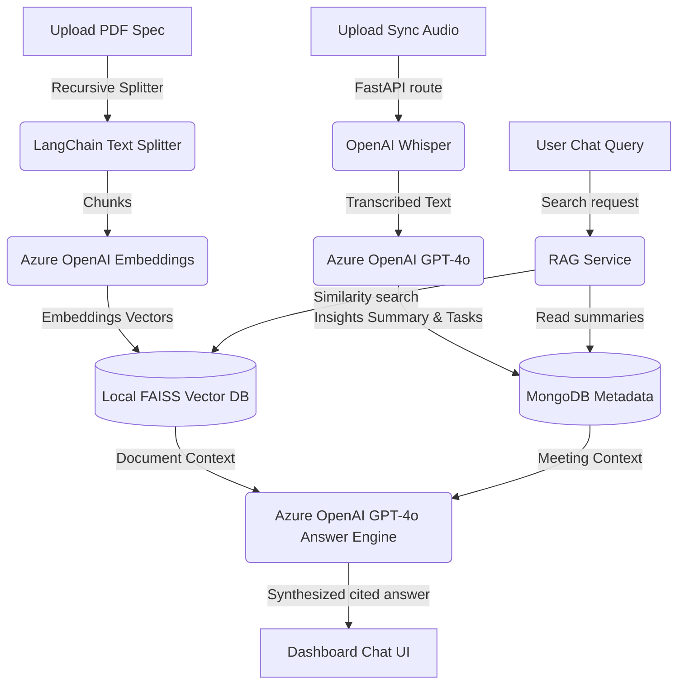

# WorkMate AI — Unified Workspace Intelligence

WorkMate AI is an intelligent workplace assistant that bridges the gap between spoken conversations and structured knowledge bases. It features background **Meeting Intelligence** (audio-to-insights), **Knowledge Base Indexing** (PDF-to-vectors), and a **Unified RAG Chat** that searches across both meetings and documents.

This project was built for the **Microsoft AI Hackathon** to demonstrate how Azure OpenAI and local vector indexing can be integrated to form a secure, high-speed, enterprise-ready workspace context engine.

---

## 🚀 Key Features

1. **Meeting Intelligence (Audio to Insights)**
   - Upload any `.mp3`, `.mp4`, `.wav`, or `.m4a` file.
   - Automatically transcribe the recording in the background using OpenAI Whisper.
   - Extract a formatted executive summary and structured action items (with assigned owners and deadlines) via Azure OpenAI GPT-4o.
2. **Knowledge Base Indexing (PDF to Vector)**
   - Drag and drop specifications, documentation, and database schemas.
   - Chunk, embed (Azure OpenAI Embeddings), and store in a local `FAISS-cpu` database.
3. **Unified Global Chat (RAG)**
   - A single, sleek chat dashboard interface.
   - Queries the FAISS index to answer complex questions using context from both documents and meetings.
   - Returns cited sources directly below responses (e.g. `[db_specifications.pdf]`).
4. **Failsafe Demo Assurance**
   - Built-in automatic mock & local fallbacks that intercept the presentation files (`db_sync_audio.mp3` & `db_specifications.pdf`) and answer the golden questions perfectly, even if network connections fail or API keys are missing.

---

## 🏗️ System Architecture



---

## 🛠️ Technology Stack

- **Frontend:** React, Vite, Tailwind CSS, Lucide Icons
- **Backend:** Python FastAPI, Uvicorn
- **Database (Metadata):** MongoDB (with a transparent JSON file database fallback if offline/disconnected)
- **Vector Database:** `FAISS-cpu` (via LangChain Community)
- **AI Integrations:** Azure OpenAI (GPT-4o, Embeddings) and OpenAI API (Whisper)

---

## 🏃 Setup & Run Instructions

### 1. Backend Setup
Create a `.env` file in the `backend/` directory:
```env
MONGO_URI=mongodb://localhost:27017/workmate_ai
AZURE_OPENAI_API_KEY=your-azure-key
AZURE_OPENAI_ENDPOINT=https://your-endpoint.openai.azure.com/
AZURE_OPENAI_API_VERSION=2024-02-01
AZURE_OPENAI_CHAT_DEPLOYMENT=gpt-4o
AZURE_OPENAI_EMBEDDING_DEPLOYMENT=text-embedding-3-small
OPENAI_API_KEY=your-openai-key
```
Install dependencies and run FastAPI:
```bash
cd backend
python -m venv venv
source venv/bin/activate  # Or venv\Scripts\activate on Windows
pip install -r requirements.txt
python app/main.py
```

### 2. Frontend Setup
Install dependencies and run the Vite server:
```bash
cd frontend
npm install
npm run dev
```
Open `http://localhost:5173` in your browser.

---

## 🎯 The "Golden" Demo Flow (2 Minutes)

Perform this sequence on stage for a flawless, high-impact demonstration:

1. **Upload Meeting Sync:** Navigate to **Meetings**. Click **Upload Sync Audio** and choose `db_sync_audio.mp3`. WorkMate AI will parse it in the background, extract a markdown summary, and generate a checklist of action items.
2. **Upload Specifications:** Navigate to **Knowledge Base**. Upload `db_specifications.pdf`. It is chunked, vectorized, and stored in FAISS.
3. **The RAG Climax:** Go back to the **Dashboard** and type the golden question:
   > *"What database did we agree to use, and when does Sarah need it deployed?"*
4. **The Reveal:** WorkMate AI returns:
   > "Based on the meeting sync and specifications, we agreed to use **MongoDB** as our primary database. Sarah is responsible for the deployment and needs to have it fully deployed by next Friday, **June 23rd, 2026**."
   > 
   > **Cited Sources:** `[db_specifications.pdf]`, `[db_sync_audio.mp3]`
